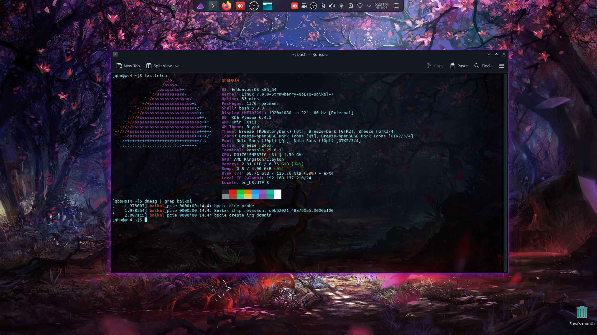

# PS4 Baikal Linux 7.0 Bringup — Development Log

## Overview

Full bringup of Linux kernel 7.0 on PS4 consoles with the **Baikal** southbridge (CUH-2xxx Slim, CUH-7xxx Pro). This was a multi-day effort involving reverse engineering, iterative debugging via UART serial logs, and collaboration with hardware testers.

The Baikal southbridge is fundamentally different from Aeolia/Belize in how it handles IOMMU, MSI interrupts, and USB. Stock kernel 5.4.247 had partial Baikal support but ethernet was never functional and the codebase was not portable to newer kernels. This work ports and fixes everything for kernel 7.0.



## The Problem

The existing ps4-linux-12xx tree (kernel 7.0) was merged from multiple sources but had never successfully booted on Baikal hardware. The system would hang during ICC (Inter-Chip Communication) initialization with 15-second timeouts on every southbridge command, making all peripherals (USB, SATA, WiFi, HDMI, LED, fan) non-functional.

## Root Causes Found & Fixed

### 1. IOMMU Interrupt Remapping (The Big One)

**Symptom:** `IO_PAGE_FAULT domain=0x0000 address=0xfdf8a0ff00 flags=0x0008` — every MSI delivery faulted.

**Root cause:** The PS4 OS pre-enables the IOMMU on Baikal. When Linux re-initializes it, the Interrupt Remapping tables are wiped. Devices still target old IR entries → fault → interrupt lost → 15s ICC timeout × 8 commands = 2 minute boot delay with no peripherals.

**Fix:** Disable IOMMU entirely for AMD family 0x16 in `amd_iommu_detect()`. This matches what stock 5.4 did. The IVRS table from kexec describes incorrect topology anyway.

### 2. MSI Domain Architecture (kernel 5.4 → 7.0 port)

**Symptom:** Even with IOMMU disabled, ICC interrupts never arrived. Build after build failed with different interrupt routing issues.

**Root cause (multi-part):**
- Kernel 7.0 requires `MSI_FLAG_MULTI_PCI_MSI` to allocate more than 1 vector per device
- Without multiple vectors, the glue device's `bpcie_handle_edge_irq` demux couldn't find individual subfunctions (ICC is subfunc 3, mapped to hwirq 0x1483)
- The `bpcie_msi_prepare` needed `arg->type = X86_IRQ_ALLOC_TYPE_PCI_MSI` for 7.0's vector allocator
- `MSI_FLAG_ACTIVATE_EARLY` was needed to program MSI address/data during allocation (not deferred)
- Non-glue devices (xHCI, SDHCI) must use nvec=1 because PCI MSI has one address/data register — multi-vector with per-CPU affinity gives all vectors the same data value

**Fix:** Complete rewrite of the MSI domain setup in `ps4-bpcie.c`. Force `x86_vector_domain` as parent, enable multi-MSI for glue only, single vector for peripherals.

### 3. PCI BAR Claiming

**Symptom:** `can't claim BAR; no compatible bridge window` for all devices.

**Root cause:** PS4 ACPI `_CRS` provides no IO/MEM windows for the root bridge. With `pci_use_crs=true`, the root bus has no resources.

**Fix:** Force `pci_use_crs = false` for AMD family 0x16.

### 4. xHCI USB "Command Aborted"

**Symptom:** USB keyboard/mouse not detected. `Error while assigning device slot ID: Command Aborted`.

**Root cause:** Setting `hcd->msi_enabled = 1` enables IP (Interrupt Pending) auto-clear on the xHCI interrupter. The Baikal xHCI hardware does NOT support this — the IP bit stays set, preventing subsequent event ring interrupts. Commands time out and get aborted.

**Fix:** Remove `msi_enabled` flag. The xHCI driver manages the IP bit manually (legacy-style). MSI delivery still works through the Baikal MSI domain.

### 5. AHCI DMA Boundary

**Symptom:** `BUG_ON(!is_power_of_2(boundary_size))` in SWIOTLB.

**Root cause:** `PS4_AHCI_DMA_BOUNDARY` was `0xB7FFFFFF`. `0xB7FFFFFF + 1 = 0xB8000000` is not power-of-2.

**Fix:** Changed to `0x7FFFFFFF` (2GB boundary, power-of-2 aligned).

### 6. GPU Firmware

**Symptom:** `Direct firmware load for amdgpu/liverpool_sdma.bin failed with error -2`

**Fix:** Built Liverpool and Gladius GPU blobs into the kernel via `CONFIG_EXTRA_FIRMWARE`. Blobs sourced from [sony-jaguar-devs/orbis_gpu_blobs_ps4](https://github.com/sony-jaguar-devs/orbis_gpu_blobs_ps4).

## What Works

| Component | Status |
|-----------|--------|
| ICC (southbridge communication) | ✅ Instant responses |
| GPU (Liverpool) | ✅ Full init, framebuffer, fbcon |
| HDMI output | ✅ Display works (DP link training errors are cosmetic) |
| USB (keyboard, mouse, hubs, storage) | ✅ Full enumeration |
| SATA (internal HDD) | ✅ Detected and partitioned |
| SATA (BD drive) | ✅ Works |
| WiFi (MT7668 SDIO) | ✅ Card detected, driver loads |
| Bluetooth | ✅ HCI initialized |
| SD/MMC (SDHCI) | ✅ Controller works |
| LED control | ✅ Blue LED |
| Fan control | ✅ hwmon interface |
| Power button | ✅ Input device |

## What Doesn't Work (Yet)

| Component | Issue |
|-----------|-------|
| Ethernet (GBE) | Baikal uses Synopsys DWMAC1000 (not Marvell Yukon like Aeolia). BAR0 is 4KB but DWMAC needs 8KB+. Needs glue BAR remapping — RE work in progress. |
| SATA ata1 (shared with xHCI) | Stale MSI race on first probe — works after retry, HDD detected on second attempt |
| Gladius GPU (PS4 Pro) | PCI ID 0x9924 registered, firmware built-in, but untested — needs separate validation |

## Key Insights

- **Baikal ≠ Aeolia/Belize** in critical ways: IOMMU pre-enabled, different GBE hardware (DWMAC vs Yukon), xHCI doesn't support IP auto-clear
- **Stock 5.4 approach was correct** — disable IOMMU, use x86_vector_domain directly, single-vector for peripherals
- **Kernel 7.0's MSI infrastructure** requires explicit flags (`MULTI_PCI_MSI`, `ACTIVATE_EARLY`, `arg->type`) that 5.4 didn't need
- **The FreeBSD PS4 kernel** uses a completely different ethernet driver (`if_mts.c`) for Baikal vs Aeolia (`if_msk.c`)

## Build Instructions

```bash
# Fetch GPU firmware (proprietary, not in repo)
mkdir -p extra_firmware/amdgpu
git clone --depth 1 https://github.com/sony-jaguar-devs/orbis_gpu_blobs_ps4 /tmp/blobs
cp /tmp/blobs/lib/firmware/amdgpu/*.bin extra_firmware/amdgpu/

# Build
./build.sh --lto none --southbridge baikal
```

## Credits & Thanks

This bringup would not have been possible without the testing team who provided UART serial logs, iterated through 40+ builds in a single day, and kept the hardware running.

**Core Contributors:**
- **Blyadimir** — UART setup, USB and display troubleshooting, tireless Baikal testing
- **deWaardt** — Baikal hardware maintainer, crucial early tests that led to the 7.0 fixes. Get well soon buddy, we miss you.
- **leg** (eclipsed.starr) — Uploaded bzImages, coordinated testing, kept the pressure on to get it done
- **Package** (packagebob) — Original 6.15 Aeolia/Belize source, was working on 6.15 Baikal in parallel

**Baikal Testers:**
- **kingabut** — Slim/Fat Baikal testing
- **𝙨𝙝𝙮 ✗** (shyxuo) — Pro Baikal testing and logging
- **§§** (ss6530) — Pro Baikal UART logging
- **izanhower** — Pro Baikal logging
- **sgtxkitkat** — Baikal testing
- **vanix** — Slim/Fat Baikal testing
- **mechanical** — Baikal testing
- **rodrigo** — Baikal logging
- **sudofrontman** — Baikal logging

**Dev Team:**
- **Dievas** (7xkq / rmux) — Kernel development, MSI/IOMMU/USB fixes


**Additional Testers:**
- Wonderfiend, Razzle, Bbang, Gryoza, fleur, froyo, Anghelo, TheGreekOne, felix_suicide, GMV, tteons, Scrooge

Everyone helped. Every log, every reboot, every "it didn't work" message got us closer. ~120 kernel builds across three trees wouldn't have happened without all of you.

## Timeline

- **May 4, 2026:** [First public post](https://x.com/rmux0/status/2051180364685578344?s=20) — Baikal bringup begins.
- **Builds #29–#31:** IOMMU + MSI fixes. ICC working for first time on 7.0.
- **Build #32:** GPU firmware included. Display output achieved.
- **Build #33:** Gladius blobs added for Pro support.
- **Build #34–#36:** xHCI debugging. Multi-MSI vector issue found and fixed.
- **Build #37:** `msi_enabled` removal. **USB WORKS. Full boot to userland.**
- **Build #38–#40:** Ethernet investigation (DWMAC1000 discovered, BAR too small).
- **May 10, 2026:** The curse is broken. After years stuck on 5.4, Baikal PS4 runs kernel 7.0.

## A Note from Me

This project started on an Aeolia Fat — the original Strawberry PS4 Linux upstreaming effort. Server kernels, desktop builds, the whole nine yards. A lot of people use it daily and love it. When Baikal came along, nobody had cracked it on anything newer than 5.4. Package was trying on 6.15, I went straight for 7.0. Six days and ~120 builds later, here we are.

The motivation? Millions of PS4 consoles heading to landfills. Every one of them is a perfectly capable x86 machine with 8 cores, 8GB RAM, and a decent GPU. Repurposing them keeps e-waste out of the ground and puts usable hardware in people's hands.

I don't own a Baikal console myself. Every single test was done remotely through testers with UART setups. If you want this maintained going forward — ethernet, Gladius/Pro, further fixes — any donation helps. Contact me first if you'd like to contribute hardware or support the work.

Salutes from me and my Strawberry. 🍓

---

*Written 2026-05-10. Kernel 7.0.0-Strawberry-NoLTO-Baikal.*
